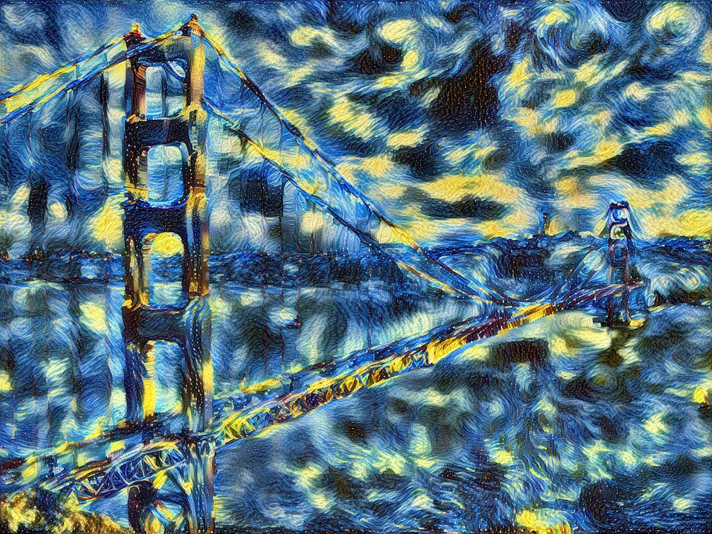
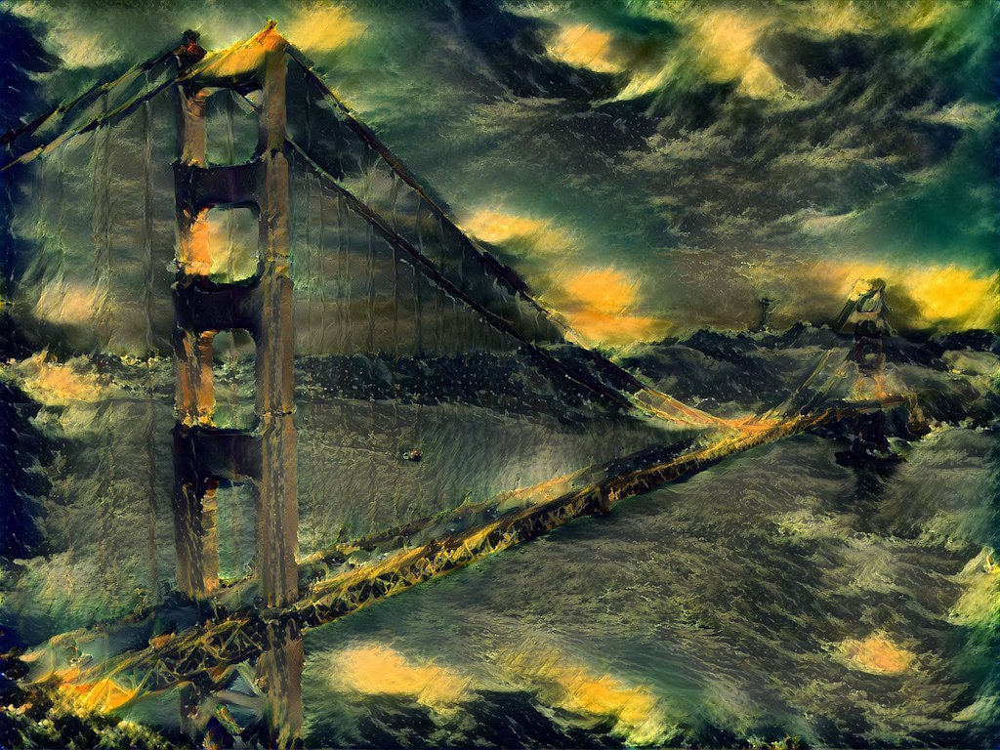
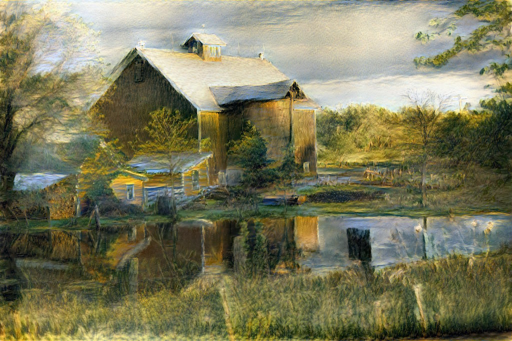

# style_transfer

Data-parallel image stylization using Caffe. Implements [A Neural Algorithm of Artistic Style](http://arxiv.org/abs/1508.06576) [1].

Dependencies:
- [Python](https://www.python.org) 2.7 or 3.5+
- [Caffe](http://caffe.berkeleyvision.org), with pycaffe compiled for Python 2.7 or 3.5+
- Python packages [numpy](http://www.numpy.org), [Pillow](https://python-pillow.org), [posix-ipc](http://semanchuk.com/philip/posix_ipc/), [scipy](http://www.scipy.org), [six](https://pythonhosted.org/six/)

The current preferred Python distribution for `style_transfer` is [Anaconda](https://www.continuum.io/downloads) (Python 3.5+ version). `style_transfer` will run faster with Anaconda than with other Python distributions due to its inclusion of the [MKL](https://software.intel.com/en-us/intel-mkl) BLAS (mathematics) library. In addition, if you are running Caffe without a GPU, `style_transfer` will run a great deal faster if compiled with MKL (`BLAS := mkl` in `Makefile.config`).

[Cloud computing images](https://github.com/crowsonkb/style_transfer/wiki/Cloud-computing-images) are available with `style_transfer` and its dependencies preinstalled.

## Features

- The image is divided into tiles which are processed one per GPU at a time. Since the tiles can be sized so as to fit into GPU memory, this allows arbitrary size images to be processed&mdash;including print size. Tile seam suppression is applied after every iteration so that seams do not accumulate and become visible. (ex: `--size 2048 --tile-size 1024`)
- Images are processed at multiple scales. Each scale's final iterate is used as the initial iterate for the following scale. Processing a large image at smaller scales first markedly improves output quality.
- Multi-GPU support (ex: `--devices 0 1 2 3`). Four GPUs, for instance, can process four tiles at a time.
- Can perform simultaneous Deep Dream and image stylization.

## Known issues

- Use of more than one content layer will produce incorrect feature maps when there is more than one tile.

## Examples

The obligatory [Golden Gate Bridge](https://raw.githubusercontent.com/jcjohnson/neural-style/master/examples/inputs/golden_gate.jpg) + [The Starry Night](https://raw.githubusercontent.com/jcjohnson/neural-style/master/examples/inputs/starry_night.jpg) (van Gogh) style transfer ([big version](https://s3-us-west-2.amazonaws.com/cb0a-46ef-cc86-8dda/style_transfer_examples/golden_gate_sn_big.jpg)):



[Golden Gate Bridge](https://raw.githubusercontent.com/jcjohnson/neural-style/master/examples/inputs/golden_gate.jpg) + [The Shipwreck of the Minotaur](https://raw.githubusercontent.com/jcjohnson/neural-style/master/examples/inputs/shipwreck.jpg) (Turner) ([big version](https://s3-us-west-2.amazonaws.com/cb0a-46ef-cc86-8dda/style_transfer_examples/golden_shipwreck.jpg)):



[barn and pond](http://r0k.us/graphics/kodak/kodim22.html) (Cindy Branham) + [The Banks of the River](https://raw.githubusercontent.com/DmitryUlyanov/fast-neural-doodle/master/data/Renoir/style.png) (Renoir) ([big version](http://cb0a-46ef-cc86-8dda.s3.amazonaws.com/style_transfer_examples/kodim22_renoir.jpg)):



## Installation

*Python 2 support is relatively untested. Please feel free to report issues! Be sure to specify which Python version you are using if you report an issue.*

*If you use pycaffe for other things, you might want to build pycaffe for Python 3 in a second copy of Caffe so you don't break things using Python 2.*

### pycaffe and Anaconda (Python 3.5 version)

On OS X (with Homebrew-provided Boost.Python):

```
ANACONDA_HOME := $(HOME)/anaconda3
PYTHON_INCLUDE := $(ANACONDA_HOME)/include \
		$(ANACONDA_HOME)/include/python3.5m \
		$(ANACONDA_HOME)/lib/python3.5/site-packages/numpy/core/include
PYTHON_LIBRARIES := boost_python3 python3.5m
PYTHON_LIB := $(ANACONDA_HOME)/lib
```

The exact name of the Boost.Python library will differ on Linux but the rest should be the same.

### Building pycaffe for Python 3.5 (OS X)

On OS X, you can install Python 3 and Boost.Python using [Homebrew](http://brew.sh):

```
brew install python3
brew install boost-python --with-python3
```

Then insert these lines into Caffe's `Makefile.config` to build against the Homebrew-provided Python 3.5:

```
PYTHON_DIR := /usr/local/opt/python3/Frameworks/Python.framework/Versions/3.5
PYTHON_LIBRARIES := boost_python3 python3.5m
PYTHON_INCLUDE := $(PYTHON_DIR)/include/python3.5m \
	/usr/local/lib/python3.5/site-packages/numpy/core/include
PYTHON_LIB := $(PYTHON_DIR)/lib
```

`make pycaffe` ought to compile the Python 3 bindings now.

### Building pycaffe for Python 3.5 (Ubuntu 16.04)

On Ubuntu 16.04, follow Caffe's [Ubuntu 15.10/16.04 install guide](https://github.com/BVLC/caffe/wiki/Ubuntu-16.04-or-15.10-Installation-Guide). The required `Makefile.config` lines for Python 3.5 are:

```
PYTHON_LIBRARIES := boost_python-py35 python3.5m
PYTHON_INCLUDE := /usr/include/python3.5m \
                  /usr/local/lib/python3.5/dist-packages/numpy/core/include
PYTHON_LIB := /usr/lib
```

### Installing style_transfer's Python dependencies (all systems)

Using pip:

```
pip3 install -Ur requirements.txt
```

## References

[1] L. Gatys, A. Ecker, M. Bethge, "[A Neural Algorithm of Artistic Style](https://arxiv.org/abs/1508.06576)"

[3] A. Mahendran, A. Vedaldi, "[Understanding Deep Image Representations by Inverting Them](https://arxiv.org/abs/1412.0035)"

[4] D. Kingma, J. Ba, "[Adam: A Method for Stochastic Optimization](https://arxiv.org/abs/1412.6980)"

[5] K. Simonyan, A. Zisserman, "[Very Deep Convolutional Networks for Large-Scale Image Recognition](https://arxiv.org/abs/1409.1556)"

[6] D. Liu, J. Nocedal, "[On the limited memory BFGS method for large scale optimization](http://users.iems.northwestern.edu/~nocedal/PDFfiles/limited-memory.pdf)"

[7] A. Skajaa, "[Limited Memory BFGS for Nonsmooth Optimization](http://cs.nyu.edu/overton/mstheses/skajaa/msthesis.pdf)"
